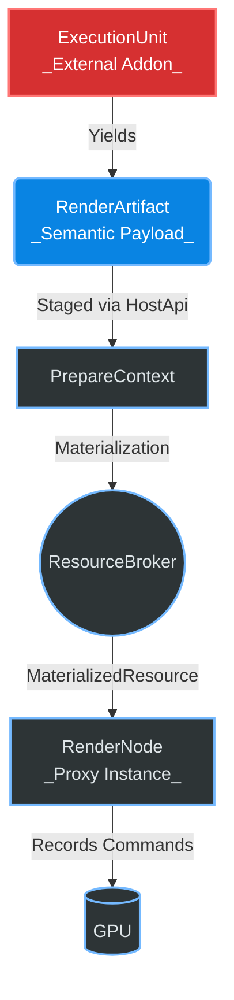

# Ascii Realtime Engine

Welcome to the **ascii-realtime** engine repository. 

## 1. Project Overview

This is a high-performance, real-time rendering engine written in Rust. Our long-term vision is to evolve from a rigid, fullscreen-only filter pipeline into a highly decoupled, capability-driven render graph capable of supporting complex, data-driven external render workloads (e.g., MSDF text, particles, 3D overlays) while strictly isolating physical GPU ownership from external addon logic.

## 2. Core Philosophy

The engine strictly separates computation from materialization and rendering.

*   **Execution Platform:** Handles native and WASM lifecycles. It unifies supervisor, sandbox, and IPC mechanisms for running external logic safely.
*   **ExecutionUnit:** The external addon logic (e.g., behaviors, render generators). ExecutionUnits compute semantic meaning, layout, and logic, but they **never** touch the GPU.
*   **RenderArtifact:** A pure-data, semantic description of render intent generated by the ExecutionUnit. It describes *what* to render, without any assumptions about memory layout, padding, or physical resources.
*   **ResourceBroker:** The only subsystem allowed to interact with the GPU for dynamic resources. It translates semantic `RenderArtifact`s into physical, hardware-aligned GPU buffers (materialization).
*   **RenderGraph:** Dictates the immutable order in which nodes are executed per frame.
*   **RenderRuntime:** Orchestrates the graph, compiling an immutable `ExecutionPlan` and commanding proxy nodes to draw.
*   **RenderNode:** Proxy instances inside the graph that consume physical resources from the Broker and record draw commands to the GPU.

## 3. High-Level Architecture

## 4. Project Goals

*   **Centralized GPU Ownership:** The engine strictly owns the `wgpu::Device` and all `wgpu::Buffer` / `wgpu::Texture` resources. Allowing addons to allocate resources directly causes memory leaks, OOMs, state desyncs, and security vulnerabilities. Centralizing this via the `ResourceBroker` ensures deterministic execution and prevents starvation.
*   **Sandboxed Addons:** ExecutionUnits (Addons) operate purely in semantic space. They parse text, calculate layouts, and describe geometry using `RenderArtifact`s. They are entirely oblivious to WGPU, Vulkan, or any specific graphics backend. This ensures ABI stability across future backend migrations.
*   **Deterministic Pipeline:** Graph ordering is immutable per frame, ensuring pipelines (e.g., Overlay → CRT → Bloom) always compose deterministically.

## 5. Current Implementation Status

*   **Phase 1: Clean Break** — `Implemented`. Introduced `RenderGraph` skeleton.
*   **Phase 2: Execution Plan** — `Implemented`. Introduced `PlanEpoch` and immutable `ExecutionPlan`.
*   **Phase 3: Semantic Artifact ABI** — `Implemented`. Implemented the entire `RenderArtifact` hierarchy and `HostApi` staging.
*   **Phase 4: Resource Broker** — `Implemented`. Implementation of `ResourceBroker`, generic `packing.rs`, zero-copy semantic-to-physical translation, and metrics.
*   **Phase 5: MSDF Implementation** — `Planned`. Build the generic `InstancedOverlayNode` proxy. Implement MSDF entirely as a CPU-based `ExecutionUnit`.

## 6. Folder Overview

*   `src/runtime/` — The core runtime engine. Contains the RenderGraph, ExecutionPlan, ResourceBroker, HostApi, and rendering loop.
*   `src/behavior/` — Native/WASM execution platform logic, IPC, and addon spawning.
*   `addons/` — External logic plugins (e.g., MSDF, particles). These depend strictly on the semantic ABI.
*   `ui/` — Front-end and developer tooling.

## 7. Contributing

Before writing any code or proposing PRs, all contributors **MUST** read:
1.  [plan.md](plan.md) — The architecture ledger and history of accepted decisions.
2.  [AGENTS.md](AGENTS.md) — The architectural constitution and explicit rules of the repository.

Architectural boundaries are strictly enforced at compile time. Read the documentation to understand where your logic belongs.
